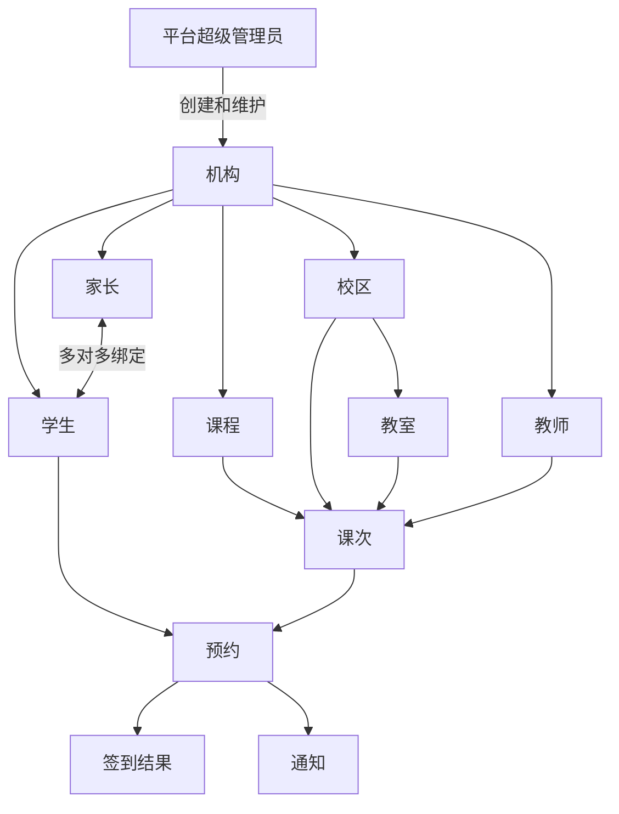
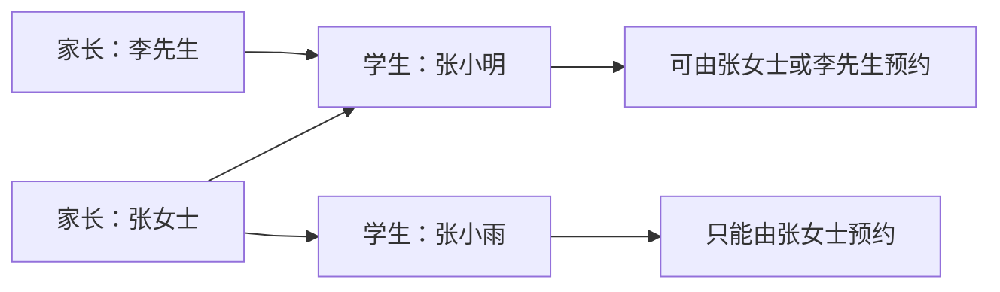
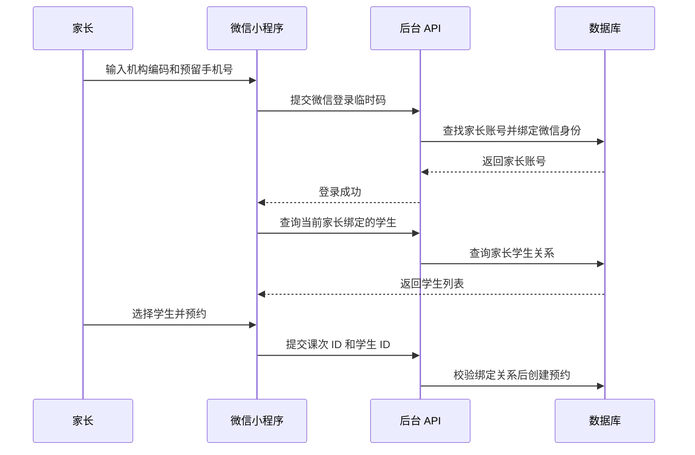
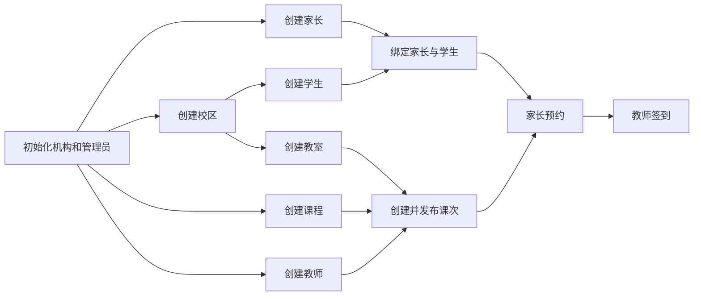
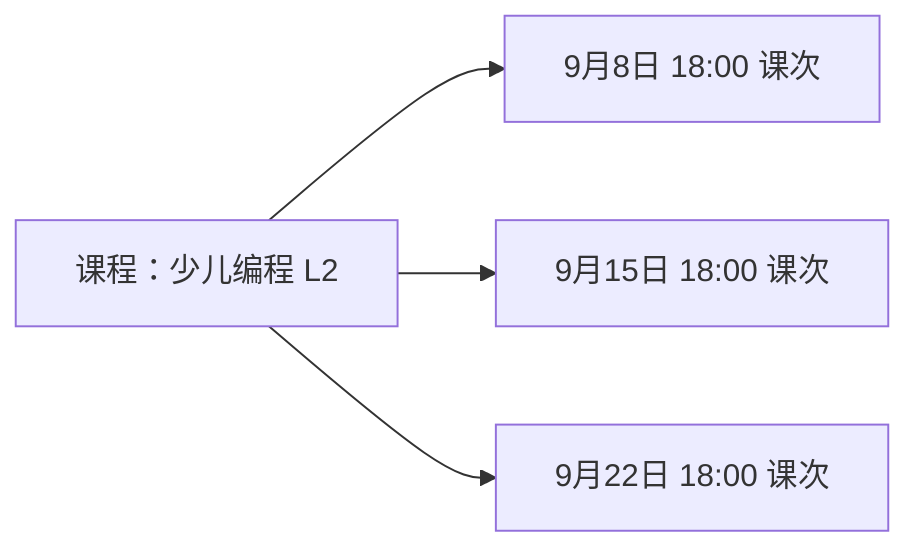
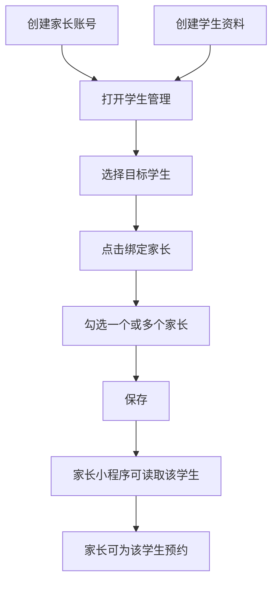
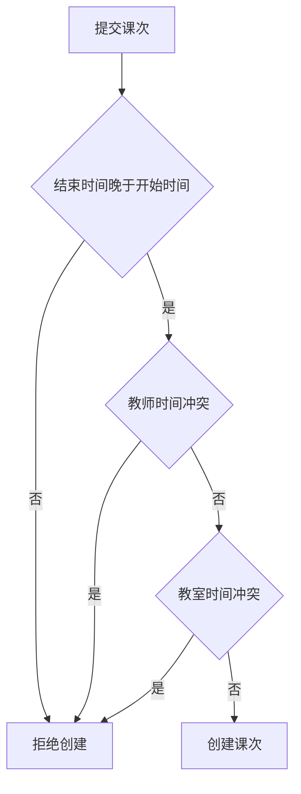
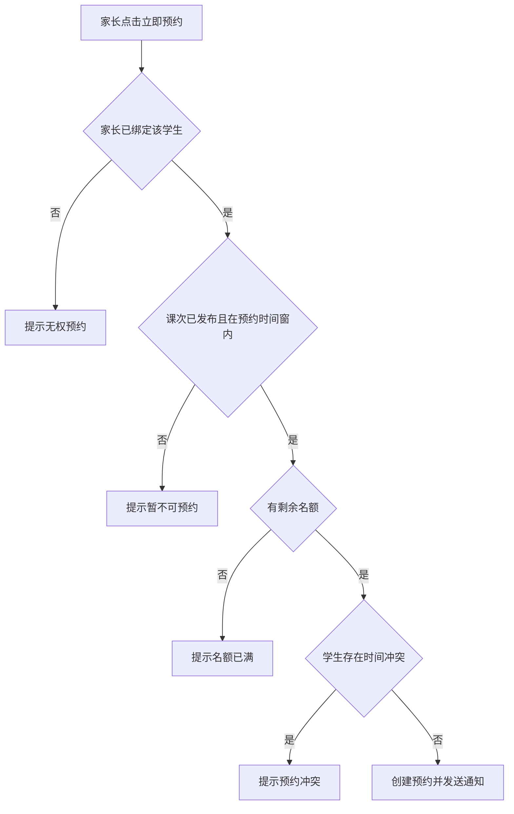
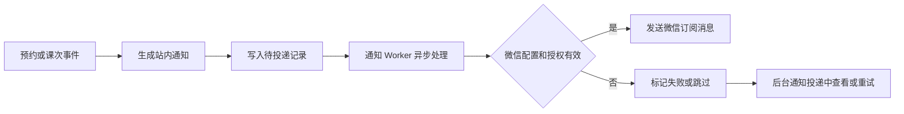

# 课序用户操作手册

> 适用版本：当前 `main` 分支及 Render 演示环境\
> 使用对象：教培机构管理员、教师、家长\
> 管理后台：<https://kebao-admin.onrender.com>

## 系统概览

课序用于管理教培机构的校区、教室、课程、教师、家长、学生、课次和预约。管理员在网页后台维护资料并排课，教师和家长通过微信小程序使用各自功能。

系统有四种管理或使用身份：

| 角色  | 使用入口   | 主要功能                      |
| --- | ------ | ------------------------- |
| 平台超级管理员 | `/platform` 平台后台 | 创建和维护机构、机构管理员及平台审计 |
| 管理员 | 网页管理后台 | 维护基础资料、排课、代预约、统计、通知和审计    |
| 教师  | 微信小程序  | 查看本人课表、创建课次、调课、停课、查看名单和签到 |
| 家长  | 微信小程序  | 选择已绑定学生、预约课程、取消预约和查看通知    |

学生没有独立登录账号。学生是课程预约和签到的主体，由家长代为操作。

## 资料关系

### 整体关系



机构是最高层的数据边界。每个校区、教室、课程、教师、家长、学生、课次和预约都归属于一个机构，不同机构之间的数据相互隔离。

### 家长与学生

家长和学生是多对多关系：

- 一个家长可以绑定多个学生，例如一位家长有两个孩子。

- 一个学生可以绑定多个家长，例如父亲和母亲都可以代为预约。

- 同一个“家长与学生”组合只能绑定一次。

- 一个学生最多设置一位主要监护人。

- 主要监护人和普通监护人都有预约权限。

- 家长只能为自己已绑定的学生预约。



家长账号与学生资料是两个不同对象。家长登录后，系统先读取该家长绑定的学生，再以所选学生的 ID 提交预约。



如果家长没有绑定学生，小程序会显示“尚未绑定学生”，预约按钮不可用。管理员需要在“学生管理”中完成绑定。

## 首次配置顺序

推荐按依赖关系创建资料，避免排课时缺少选项。



推荐顺序：

1. 平台超级管理员创建机构和机构管理员。
2. 创建校区。
3. 创建教室。
4. 创建课程。
5. 创建教师。
6. 创建家长。
7. 创建学生。
8. 绑定学生与家长。
9. 创建并发布课次。
10. 家长预约或管理员代预约。
11. 教师上课后签到。

## 机构和管理员

### 平台管理入口

平台超级管理员通过以下地址登录：

```text
https://kebao-admin.onrender.com/platform
```

平台账号不属于任何机构，也不能使用平台令牌访问机构排课、学生或预约接口。平台管理员可执行：

- 新增、编辑、启用、停用和逻辑删除机构。
- 为指定机构创建管理员。
- 编辑或停用机构管理员。
- 重置机构管理员密码。
- 撤销机构管理员的全部登录会话。
- 查看平台级操作审计日志。

平台初始化账号由部署环境变量创建：

```dotenv
PLATFORM_ADMIN_USERNAME="superadmin"
PLATFORM_ADMIN_PASSWORD="首次登录临时密码"
```

首次登录必须修改临时密码。种子脚本只创建缺失账号，不会在重新部署时覆盖已经修改的密码。

### 创建机构

1. 打开平台管理入口并登录。
2. 首次登录时先修改临时密码。
3. 点击“新增机构”。
4. 填写机构编码和机构名称。
5. 保存后，机构编码会自动规范为大写。

停用机构会立即撤销该机构所有登录会话，机构管理员、教师和家长都需要等待机构重新启用后再次登录。删除采用逻辑删除，不会物理清除历史课次、预约和审计数据。

### 创建机构管理员

1. 在平台管理页面选择机构。
2. 点击“创建管理员”。
3. 填写姓名、手机号和邮箱。
4. 保存后复制系统生成的一次性临时密码。
5. 把机构编码、手机号和临时密码安全交给机构管理员。
6. 机构管理员首次登录后必须设置新密码。

临时密码关闭弹窗后不能再次查看。忘记密码时，平台超级管理员点击“重置密码”，系统生成新的临时密码，并立即撤销该管理员原有的全部登录会话。

机构管理员登录后可在后台点击“修改密码”自行更新密码。修改成功后旧会话失效，需要使用新密码重新登录。

### 演示机构

Render 演示环境的默认机构是：

| 项目     | 内容                                |
| ------ | --------------------------------- |
| 机构名称   | 演示机构                              |
| 机构编码   | `DEMO`                            |
| 管理员手机号 | `13800000001`                     |
| 管理员密码  | Render 中配置的 `SEED_ADMIN_PASSWORD` |

机构管理员登录普通后台时需要输入机构编码、手机号和密码。

### 机构编码的作用

机构编码用于确认用户属于哪个机构。教师和家长登录微信小程序时也需要填写同一个机构编码。

同一个机构内：

- 手机号不能被多个管理员、教师或家长账号重复使用。

- 微信 OpenID 不能绑定多个账号。

- 校区名称、课程名称等字段遵循各自的唯一规则。

不同机构之间可以使用相同手机号或相同资料名称，数据仍保持隔离。

## 校区管理

校区代表机构的实际教学地点。教室必须归属于校区，课次也必须选择校区。

### 创建校区

1. 登录管理后台。
2. 打开“校区管理”。
3. 点击“新增校区”。
4. 填写资料。
5. 点击“保存”。

| 字段   | 要求                    |
| ---- | --------------------- |
| 校区名称 | 必填，同一机构内不能重复          |
| 地址   | 可选                    |
| 联系电话 | 可选                    |
| 时区   | 必填，默认 `Asia/Shanghai` |
| 状态   | 默认启用                  |

### 使用建议

- 先创建校区，再创建教室。

- 校区停用后不应继续用于新排课。

- 已被教室、学生或课次引用的校区不要直接删除，应改为停用。

## 教室管理

每个教室必须属于一个校区。排课时选择校区后，只能选择该校区下的教室。

### 创建教室

1. 打开“教室管理”。
2. 点击“新增教室”。
3. 选择所属校区。
4. 填写教室名称、编码和容量。
5. 点击“保存”。

| 字段   | 要求           |
| ---- | ------------ |
| 教室名称 | 必填           |
| 所属校区 | 必填           |
| 教室编码 | 可选，同一校区内不能重复 |
| 容量   | 必填，正整数       |
| 状态   | 默认启用         |

同一校区内教室名称不能重复，不同校区可以存在同名教室。

> 当前课次容量不会自动受教室容量限制。排课时应人工确认课次容量不超过教室实际容量。

## 课程管理

课程是教学内容模板，课次是课程在具体日期、时间和地点的一次实际开课。



### 创建课程

1. 打开“课程管理”。
2. 点击“新增课程”。
3. 填写课程资料。
4. 点击“保存”。

| 字段   | 要求           |
| ---- | ------------ |
| 课程名称 | 必填，同一机构内不能重复 |
| 课程编码 | 可选，同一机构内不能重复 |
| 默认时长 | 必填，正整数，单位为分钟 |
| 课程说明 | 可选           |
| 状态   | 默认启用         |

课程不直接绑定校区或教师。创建课次时再组合课程、校区、教室和教师。

> 当前课程默认时长不会自动计算课次结束时间。创建课次时仍需手工填写开始时间和结束时间。

## 教师管理

后台创建教师后，教师可以使用微信小程序登录，并查看或管理本人课次。

### 创建教师

1. 打开“老师管理”。
2. 点击“新增老师”。
3. 填写教师资料。
4. 点击“保存”。

| 字段   | 要求              |
| ---- | --------------- |
| 姓名   | 必填              |
| 手机号  | 微信登录时必需，同一机构内唯一 |
| 邮箱   | 可选              |
| 擅长课程 | 可选，自由文本         |
| 备注   | 可选              |
| 状态   | 默认启用            |

“擅长课程”仅用于资料展示，不会限制教师能否教授某门课程。

### 微信登录

个人主体演示模式的登录步骤：

1. 在小程序登录页填写机构编码。
2. 填写后台为该教师预留的手机号。
3. 可勾选“记住登录信息”。
4. 点击“绑定微信并登录”。
5. 首次登录时，系统把该教师账号与当前微信身份绑定。

同一教师账号绑定微信后，其他微信不能再使用该手机号登录。需要更换绑定微信时，应先由管理员执行解绑；当前版本尚未提供可视化解绑页面。

## 家长管理

家长账号用于微信登录和代学生预约。创建家长后，还必须把家长绑定到学生。

### 创建家长

1. 打开“家长管理”。
2. 点击“新增家长”。
3. 填写家长资料。
4. 点击“保存”。

| 字段  | 要求              |
| --- | --------------- |
| 姓名  | 必填              |
| 手机号 | 微信登录时必需，同一机构内唯一 |
| 邮箱  | 可选              |
| 备注  | 可选              |
| 状态  | 默认启用            |

同一个手机号不能同时创建为教师和家长。如果同一个人同时具有教师和家长身份，当前版本需要使用不同手机号或后续升级为多角色账号模型。

### 微信登录

个人主体演示模式下，家长使用“机构编码 + 后台预留手机号”绑定当前微信。勾选“记住登录信息”后，下次会自动回填机构编码和手机号，但仍需点击登录按钮。

## 学生管理

学生是预约和签到的主体，不需要单独登录。

### 创建学生

1. 打开“学生管理”。
2. 点击“新增学生”。
3. 填写学生资料。
4. 点击“保存”。

| 字段   | 要求   |
| ---- | ---- |
| 姓名   | 必填   |
| 联系电话 | 可选   |
| 性别   | 可选   |
| 出生日期 | 可选   |
| 所属校区 | 可选   |
| 备注   | 可选   |
| 状态   | 默认启用 |

学生所属校区仅用于资料管理，当前不会限制学生预约其他校区的课程。

### 绑定家长

1. 在“学生管理”找到目标学生。
2. 点击“绑定家长”。
3. 勾选一个或多个已启用家长。
4. 保存绑定关系。

当前界面会把第一个选中的家长设为主要监护人，其他家长为普通监护人。所有已绑定家长都有预约权限。



### 绑定检查

家长登录小程序后：

- 绑定一个学生时，系统默认选择该学生。

- 绑定多个学生时，页面显示学生切换入口。

- 没有绑定学生时，页面提示联系机构管理员，预约按钮不可用。

如果出现“无权为该学生预约”，先检查：

1. 登录手机号是否对应正确的家长账号。
2. 该家长是否已在“学生管理”中绑定目标学生。
3. 小程序是否已重新编译并加载最新版本。
4. 页面顶部显示的“当前学生”是否正确。

## 课次管理

课次把课程、教师、校区、教室和具体时间组合起来，是家长实际预约的对象。

### 创建单次课

1. 打开“课次管理”。
2. 点击创建课次。
3. 选择课程。
4. 选择校区。
5. 选择该校区下的教室。
6. 选择教师。
7. 选择上课日期、开始时间和结束时间。
8. 填写课次容量。
9. 选择“草稿”或“已发布”。
10. 保存。

| 字段      | 说明           |
| ------- | ------------ |
| 课程      | 从已启用课程中选择    |
| 校区      | 从已启用校区中选择    |
| 教室      | 必须属于所选校区     |
| 教师      | 从已启用教师中选择    |
| 开始和结束时间 | 结束时间必须晚于开始时间 |
| 容量      | 正整数          |
| 状态      | 家长只能预约已发布课次  |

### 课次状态

| 状态              | 含义         |
| --------------- | ---------- |
| 草稿 `DRAFT`      | 尚未开放给家长    |
| 已发布 `PUBLISHED` | 可在预约时间窗内预约 |
| 已关闭 `CLOSED`    | 不再接受普通家长预约 |
| 已取消 `CANCELLED` | 课程停课       |
| 已结束 `FINISHED`  | 课程已结束      |

### 时间冲突

系统会阻止：

- 同一教师在重叠时间内教授两个有效课次。

- 同一教室在重叠时间内安排两个有效课次。

- 学生预约两个时间重叠的有效课次。

前一个课次结束时间等于后一个课次开始时间时，不算冲突。



### 重复排课

按周重复排课适合固定周课：

1. 选择“按周重复”。
2. 设置重复次数。
3. 预检冲突。
4. 选择整批创建或跳过冲突日期。
5. 确认创建。

默认规则：

- 重复间隔为每 1 周。

- 可重复 1 至 104 次。

- “整批失败”模式下，任一日期冲突则全部不创建。

- “跳过冲突日期”模式下，只创建没有冲突的日期。

### 调课

管理员可调整课次时间、教师或教室。系统会重新检查教师、教室和已预约学生的时间冲突。

系列课次支持：

- 仅调整本次。

- 调整本次及以后的课次。

调课成功后，预约时间窗随课次时间同步移动，并生成相关通知。

### 停课

管理员可停掉单次课或系列中本次及以后的课次。停课后：

- 课次状态变为已取消。

- 有效预约变为课程取消。

- 相关家长收到站内通知。

- 配置微信订阅消息后可异步发送微信通知。

已结束课次不能停课，已取消课次当前不能恢复。

## 预约管理

### 家长预约

家长预约需要同时满足：

1. 家长账号已启用。
2. 家长已绑定所选学生。
3. 课次状态为已发布。
4. 当前时间在预约开放和截止时间内。
5. 课次仍有剩余名额。
6. 学生没有时间重叠的有效预约。



默认预约时间窗：

- 开课前 7 天开放预约。

- 开课前 2 小时停止预约。

- 开课前 4 小时停止家长自助取消。

当前后台创建课次页面不能单独配置这些时间窗。

### 管理员代预约

管理员可以在“预约管理”中为学生代预约：

1. 选择课次。
2. 选择学生。
3. 确认代预约。

管理员代预约可以绕过普通预约时间窗，但仍会检查：

- 课次容量。

- 重复预约。

- 学生时间冲突。

### 取消预约

家长只能在自助取消截止时间前取消。超过截止时间后，需要管理员在“预约管理”中代为取消，并填写取消原因。

管理员代取消会写入审计日志，并通知家长和教师。

### 我的课程

当前家长端“我的课程”使用当前微信设备的本地预约记录。因此：

- 换手机后不一定显示此前预约。

- 清除小程序缓存后不一定显示此前预约。

- 管理员代预约不会自动写入该手机的本地记录。

- 完整记录应以后台“预约管理”为准。

## 教师小程序

教师登录后只能查看和操作自己的课次。

主要功能：

- 查看日课表和周课表。

- 创建本人课次。

- 调整本人课次。

- 停掉本人课次。

- 查看预约学生名单。

- 标记已到、请假或缺席。

教师不能：

- 查看其他教师的课次名单。

- 把自己的课次转给其他教师。

- 操作其他机构的数据。

### 签到状态

| 状态 | 含义       |
| -- | -------- |
| 已到 | 学生正常到课   |
| 请假 | 学生提前请假   |
| 缺席 | 学生未到且未请假 |

## 通知管理

系统支持以下通知：

- 预约成功。

- 预约取消。

- 调课。

- 停课。

- 开课前 24 小时提醒。

- 开课前 2 小时提醒。

### 通知链路



微信发送失败不会回滚预约、取消、调课或停课。业务结果以后台记录为准。

通知投递状态包括：

- 待发送。

- 发送中。

- 已发送。

- 发送失败。

- 已跳过。

管理员可以在“通知投递”中查看发送结果，并重试失败或跳过的记录。

## 经营统计

“经营统计”支持按以下条件筛选：

- 日期范围。

- 校区。

- 课程。

- 教师。

主要指标：

| 指标   | 说明           |
| ---- | ------------ |
| 课次数  | 有效课次数量       |
| 预约人次 | 有效课次下的预约总数   |
| 上座率  | 有效占位人数 ÷ 总容量 |
| 取消率  | 用户取消数 ÷ 预约人次 |
| 到课率  | 已到人数 ÷ 已签到人数 |

统计页面支持课次明细和 CSV 导出。导出操作会写入审计日志。

## 审计日志

管理员可以在“审计日志”查看关键操作，包括：

- 创建课次和排课系列。

- 调课和停课。

- 创建或取消预约。

- 管理员代预约和代取消。

- 更新签到。

- 新增、修改、启停和删除基础资料。

- 更新学生家长绑定。

- 导出统计数据。

日志包含操作时间、操作人、操作类型、对象和详细数据。

## 演示环境使用

### 管理后台

打开：

<https://kebao-admin.onrender.com>

填写：

```text
机构编码：DEMO
管理员手机号：13800000001
密码：Render 中配置的 SEED_ADMIN_PASSWORD
```

Render 免费实例在长时间无访问后会休眠。演示前建议提前打开后台，等待服务唤醒。

### 微信小程序

在项目根目录运行：

```bash
pnpm install
pnpm dev:miniapp
```

微信开发者工具操作：

1. 导入 `apps/miniapp`。
2. 确认 AppID 正确。
3. 清除全部缓存。
4. 点击编译。
5. 点击真机调试并扫描新二维码。

个人主体演示登录：

1. 输入机构编码 `DEMO`。
2. 输入后台预留的教师或家长手机号。
3. 可勾选“记住登录信息”。
4. 点击“绑定微信并登录”。

小程序当前访问：

```text
https://kebao-admin.onrender.com
```

微信公众平台的 `request` 合法域名也需要配置为该地址。

## 常见问题

### 手机号或密码错误

管理员登录失败时检查：

- 机构编码是否为正确值。

- 手机号是否属于当前机构的管理员。

- 密码是否为 Render 当前配置并已同步的 `SEED_ADMIN_PASSWORD`。

- 密码长度是否至少 8 位。

- 是否误输入空格或大小写。

### 新增教师或家长提示手机号重复

同一机构内，管理员、教师和家长共用手机号唯一约束。一个手机号不能同时创建多个角色账号。

### 家长显示无权预约

检查：

1. 家长是否已绑定目标学生。
2. 小程序顶部“当前学生”是否正确。
3. 是否重新编译并扫描了最新真机调试二维码。
4. 当前登录微信是否绑定了正确的家长账号。

### 家长页面显示尚未绑定学生

管理员需要进入“学生管理”，找到学生并点击“绑定家长”，选择该家长后保存。

### 微信身份已绑定其他用户

该微信 OpenID 已绑定另一个账号，或当前手机号已绑定其他微信。当前版本没有后台解绑页面，需要由技术人员执行解绑。

### 访问令牌已过期

访问令牌有效期为 15 分钟，刷新会话有效期为 30 天。后台会自动续期；如果刷新会话也已过期，需要重新登录。

### Render 显示 Service Waking Up

Render 免费实例正在从休眠状态启动。等待服务完全唤醒后刷新页面，正式演示前可提前打开后台。

### 小程序请求失败

检查：

- Render 服务是否已唤醒。

- 小程序构建产物是否指向 Render 地址。

- 微信公众平台是否配置 `request` 合法域名。

- 是否使用最新编译生成的真机调试二维码。

### 课次无法创建

检查：

- 结束时间是否晚于开始时间。

- 教师是否存在时间冲突。

- 教室是否存在时间冲突。

- 教室是否属于所选校区。

- 课程、教师、校区和教室是否已启用。

### 家长无法取消预约

家长自助取消截止时间默认为开课前 4 小时。超过截止时间后，由管理员在“预约管理”中填写原因并代为取消。

## 当前版本限制

- 没有自定义角色和权限配置。
- 平台超级管理员账号由部署环境变量初始化，当前页面不支持创建其他平台管理员。
- 同一手机号不能同时拥有教师和家长角色。

- 没有微信绑定解绑页面。

- 没有候补和排队机制。

- 预约时间窗不能在后台页面单独配置。

- 课程默认时长不会自动带入课次结束时间。

- 教室容量不会自动限制课次容量。

- 教师与课程、校区没有固定绑定关系。

- 家长端“我的课程”依赖本机缓存，不是完整服务端预约历史。

- 教师小程序目前默认只调整或取消当前单次课。

- 个人主体演示登录通过后台预留手机号绑定微信身份，正式商用应使用已认证非个人主体的手机号授权能力，或增加短信验证码。

## 日常使用建议

1. 基础资料不再使用时优先停用，避免删除已被业务记录引用的数据。
2. 创建教师和家长时填写真实、唯一的手机号。
3. 创建学生后立即绑定家长，再让家长登录小程序。
4. 排课前检查课程、教师、校区和教室均处于启用状态。
5. 发布重复课次前先查看冲突预检结果。
6. 预约和签到记录以后台数据为准。
7. 演示前提前唤醒 Render，并重新编译小程序。
8. 公共电脑不要勾选后台“记住登录信息”。
